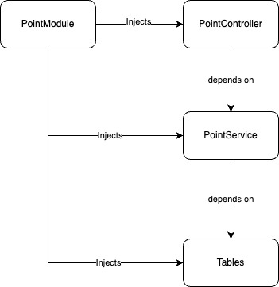
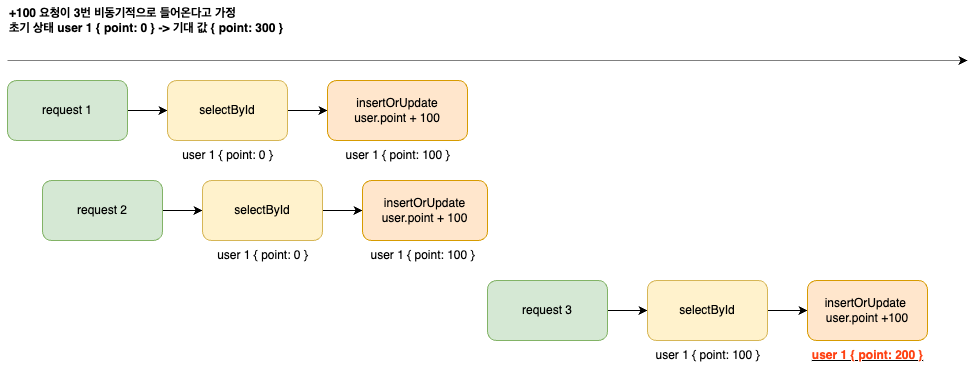
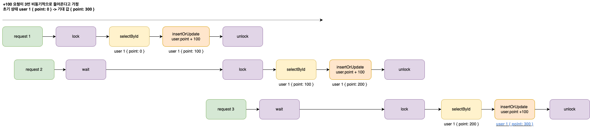

# [ 1주차 과제 ] TDD 로 개발하기

## 아키텍처 구성



## 새로 작성한 코드

- src/point/point.service.ts (포인트 도메인 로직)
- src/point/point.service.spec.ts (포인트 도메인 로직 유닛 테스트)
- src/point/point.controller.spec.ts (포인트 컨트롤러 유닛 테스트)
- test/app.e2e-spec.ts (API 호출 및 동시성 테스트)

## 트러블 슈팅

```ts
const requests = await Promise.all(
  Array.from({length: 10}, (_, i) => {
    return request(app.getHttpServer()).patch('/point/1/charge').send({
      amount: 10000,
    })
  }),
)
```

### 증상

병렬로 요청을 보내면, 기대 합이 다른 문제가 발생

### 원인 분석

요청이 여러번 들어왔을 때, 데이터를 읽고 쓰는 시점에 동기화 문제가 발생함.

```ts
// 읽는 시점
const userPointBeforeUpsert = await this.userPointTable.selectById(userId)

// 쓰는 시점
const userPointAfterUpsert = await this.userPointTable.insertOrUpdate(
  userId,
  userPointBeforeUpsert.point + amount,
)
```



### 해결 방법

lock 을 이용한 쓰기 권한 관리

```ts
class PointService {
  private writeLock: boolean = false

  /**
   *
   * busy waiting
   * @param interval checking interval (default 10ms)
   */
  private waitWriteLock(interval?: number) {
    return new Promise(resolve => {
      const checkLock = () => {
        if (this.writeLock) {
          setTimeout(checkLock, interval ?? 10)
        } else {
          resolve(true)
        }
      }
      checkLock()
    })
  }
}
```

setTimeout 을 이용하여, 싱글 스레드 환경에서 busy waiting 을 구현함

```
async charge() {
  await this.waitWriteLock()
  this.writeLock = true
  // ...
  this.writeLock = false
}
```



위와 같이 사용하여, 동시에 하나의 작업만 쓰기 작업을 수행할 수 있도록 제한함

## 리팩토링

### Table 단위 Lock -> User 단위 Lock

```ts
export class PointService {
  private writeLockTable: Record<number, boolean> = {}

  /**
   *
   * busy waiting
   * @param userId user's ID
   * @param interval checking interval (default 10ms)
   */
  private waitWriteLock(userId: number, interval?: number) {
    return new Promise(resolve => {
      const checkLock = () => {
        if (this.writeLockTable[userId]) {
          setTimeout(checkLock, interval ?? 10)
        } else {
          resolve(true)
        }
      }
      checkLock()
    })
  }
}
```

Map 자료 구조를 이용하여, 기존 Table 단위 Lock 과 User 단위 Lock 으로 리팩토링 함.

### 동시성 테스트

```ts
    it('Charge and Use user points concurrently - outcome depends on which request is handled first', async () => {
  // Send charge and use requests concurrently
  const requests = [
    request(app.getHttpServer())
      .patch('/point/1/charge')
      .send({ amount: 10000 }),
    request(app.getHttpServer())
      .patch('/point/1/use')
      .send({ amount: 30000 }),
  ]

  // Handled first request
  const firstResponse = await Promise.race(requests)

  // Both would have been processed and completed here
  const chargeResponse = await requests[0]
  const useResponse = await requests[1]

  // Check remaining points.
  const finalPointResponse = await request(app.getHttpServer()).get(
    '/point/1',
  )

  /**
   * If the charge request is handled first, the balance will be 0.
   * If the use request is handled first, the balance will be 30000.
   */
  switch (firstResponse) {
    case chargeResponse:
      expect(finalPointResponse.body.point).toBe(0)
      break
    case useResponse:
      expect(finalPointResponse.body.point).toBe(30000)
      break
  }
})
it('Charge and Use user points concurrently - outcome depends on which request has the error (Network)', async () => {
  // Mock functions randomly that always throw Error
  const mockChargeRequest = randomlyFails((id, amount) =>
    request(app.getHttpServer())
      .patch(`/point/${id}/charge`)
      .send({ amount }),
  )
  const mockUseRequest = randomlyFails((id, amount) =>
    request(app.getHttpServer()).patch(`/point/${id}/use`).send({ amount }),
  )

  // Send charge and use requests concurrently
  const requests = [
    mockUseRequest('1', 10000),
    mockChargeRequest('1', 10000),
  ]

  const [useResponse, chargeResponse] = await Promise.allSettled(requests)

  // Check remaining points.
  const finalPointResponse = await request(app.getHttpServer()).get(
    '/point/1',
  )

  /**
   * Check outcome depends on which request has the error (Network)
   */
  if (
    useResponse.status === 'rejected' &&
    chargeResponse.status === 'rejected'
  ) {
    expect(finalPointResponse.body.point).toBe(20000)
  }

  if (
    useResponse.status === 'rejected' &&
    chargeResponse.status === 'fulfilled'
  ) {
    expect(finalPointResponse.body.point).toBe(30000)
  }

  if (
    useResponse.status === 'fulfilled' &&
    chargeResponse.status === 'rejected'
  ) {
    expect(finalPointResponse.body.point).toBe(10000)
  }

  if (
    useResponse.status === 'fulfilled' &&
    chargeResponse.status === 'fulfilled'
  ) {
    expect(finalPointResponse.body.point).toBe(20000)
  }
})
```

동시에 요청을 보내고, 요청이 처리 되는 순서에 따라 기대 값을 미리 준비하여 테스트 함.
