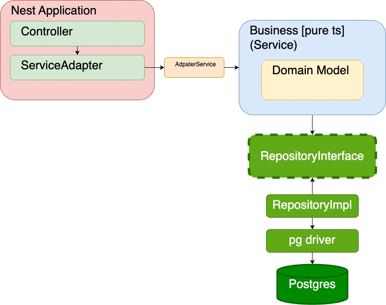

# Architecture 설계

## 설명

`SpecialLecturesService`(비즈니스 로직)는 TypeScript로만 완성되어 있으며, Nest에 대한 의존성이 없어 다양한 프레임워크에서 활용 가능합니다. 이번 과제를 Nest.js로 진행하기
위해, TypeScript 구현체를 Nest의 서비스로 통합하는 `ServiceAdapter`를 구현했습니다. 이를 통해 비즈니스 로직이 Nest 애플리케이션을 의존하는 것이 아니라, Nest 애플리케이션이 비즈니스
로직에 의존하도록 구성했습니다.

Persistence 를 위해 `RepositoryInterface`를 작성했습니다. 비즈니스 로직은 `RepositoryInterface`를 참조하며, 실제 구현체
또한 `RepositoryInterface`를 기반으로 합니다. 이 구조를 통해 사용되는 DB 드라이버와 상관없이 `RepositoryImpl`(구현체)을 통해 DB 드라이버와 비즈니스 로직 간의 커뮤니케이션이
가능합니다.
