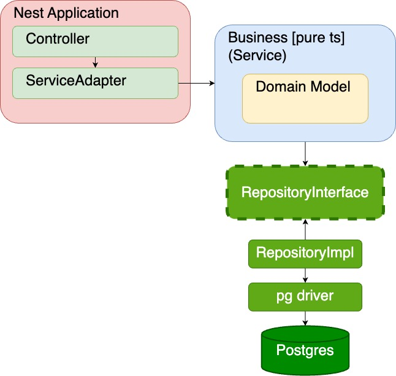
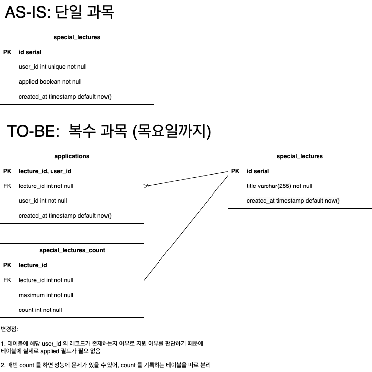

# Architecture 설계



## 설명

`SpecialLecturesService`(비즈니스 로직)는 TypeScript로만 완성되어 있으며, Nest에 대한 의존성이 없어 다양한 프레임워크에서 활용 가능합니다. 이번 과제를 Nest.js로 진행하기
위해, TypeScript 구현체를 Nest의 서비스로 통합하는 `SpecialLecturesServiceAdapter`를 구현했습니다. 이를 통해 비즈니스 로직이 Nest 애플리케이션을 의존하는 것이 아니라,
Nest 애플리케이션이 비즈니스
로직에 의존하도록 구성했습니다.

Persistence 를 위해 `RepositoryInterface`를 작성했습니다. 비즈니스 로직은 `RepositoryInterface`를 참조하며, 실제 구현체
또한 `RepositoryInterface`를 기반으로 합니다. 이 구조를 통해 사용되는 DB 드라이버와 상관없이 `RepositoryImpl`(구현체)을 통해 DB 드라이버와 비즈니스 로직 간의 커뮤니케이션이
가능합니다.

# 도메인 설명

## 핵심 용어

- `specialLecture`: 특강
    - `application`: 신청 (특강의 하위 항목)
    - `count`: 신청 수 (특강의 하위 항목)
- `user`: 사용자

## 핵심 구조

### 디렉토리

- `[도메인]/*`: 해당 도메인과 관련된 디렉토리
- `[도메인]/models/`: 도메인 모델 정의
- `[도메인]/entities/`: DB 에 종속된 엔티티 정의
- `[도메인]/mocks/`: 테스트 모킹 함수 (유닛테스트)
- `[도메인]/dto/`: 클라이언트와 컨트롤러간 DTO

### 레이어

#### Business Layer

- `[도메인]/[도메인].service.ts`: 도메인 비지니스 로직 (Nest 에 종속적이 않은 형태로 작성)
- `[도메인]/[도메인].service.spec.ts`: 도메인 비지니스 로직 유닛테스트 (Nest 에 종속적이 않은 형태로 작성)
- `[도메인]/[도메인].repository.interface.ts`: 도메인 레포지토리 인터페이스 (Nest 에 종속적이 않은 형태로 작성)

#### Persistence Layer

- `[도메인]/[도메인].repository.impl.ts`: 레포지토리 구현체 (Nest 에 종속적이 않은 형태로 작성)

#### Nest Application Layer (Presentation)

- `[도메인]/[도메인].controller.ts`: Nest 컨트롤러
- `[도메인]/[도메인].service.adapter.ts`: Nest 서비스 어댑터 (Adapter -> Service)

# ERD



# 서버 실행

### Postgres (Docker Compose)

```sh
docker compose up --build -d
```

### Nest Application

```sh
DB_USER=user DB_PASSWORD=password DB_NAME=test pnpm start
```
